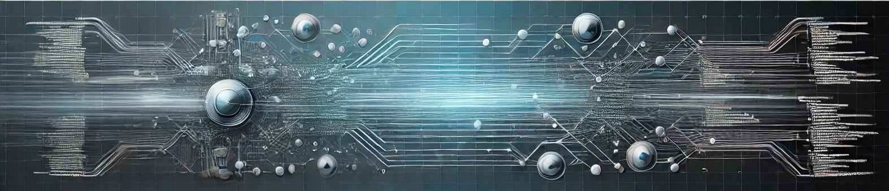

[](https://jonaslagoni.github.io/design-patterns)

[](https://www.repostatus.org/#active)
[](https://github.com/jonaslagoni/design-patterns/commits/main)
[](https://jonaslagoni.github.io/design-patterns/)  <!-- ALL-CONTRIBUTORS-BADGE:START - Do not remove or modify this section -->
[](#contributors-)
<!-- ALL-CONTRIBUTORS-BADGE:END -->

# Design Patterns for AsyncAPI


## Spinning up the website locally

```
python3 -m venv pyenv
source pyenv/bin/activate
pip install mkdocs-material
mkdocs serve
```

Windows
```
py -m venv pyenv
source pyenv/Scripts/activate
pip install mkdocs-material
mkdocs serve
```

Open http://127.0.0.1:8000

> Doc rendering is using [mkdocs material](https://squidfunk.github.io/mkdocs-material/).


## Contributors 

Thanks go out to these wonderful people ([emoji key](https://allcontributors.org/docs/en/emoji-key)):

<!-- ALL-CONTRIBUTORS-LIST:START - Do not remove or modify this section -->
<!-- prettier-ignore-start -->
<!-- markdownlint-disable -->
<table>
  <tbody>
    <tr>	  
      <td align="center" valign="top" width="14.28%"><a href="https://github.com/Amzani"><br /><sub><b>Samir AMZANI</b></sub></a><br /> <a href="https://github.com/jonaslagoni/design-patterns/commits?author=Amzani" title="Documentation">📖</a> <a href="#ideas-Amzani" title="Ideas, Planning, & Feedback">🤔</a> <a href="#maintenance-Amzani" title="Maintenance">🚧</a> <a href="https://github.com/jonaslagoni/design-patterns/pulls?q=is%3Apr+reviewed-by%3AAmzani" title="Reviewed Pull Requests">👀</a></td>
      <td align="center" valign="top" width="14.28%"><a href="https://github.com/jonaslagoni"><br /><sub><b>Jonas Lagoni</b></sub></a><br /> <a href="https://github.com/asyncapi/modelina/commits?author=jonaslagoni" title="Documentation">📖</a> <a href="#ideas-jonaslagoni" title="Ideas, Planning, & Feedback">🤔</a> <a href="#maintenance-jonaslagoni" title="Maintenance">🚧</a> <a href="https://github.com/asyncapi/modelina/pulls?q=is%3Apr+reviewed-by%3Ajonaslagoni" title="Reviewed Pull Requests">👀</a></td>
    </tr>
  </tbody>
</table>

<!-- markdownlint-restore -->
<!-- prettier-ignore-end -->

<!-- ALL-CONTRIBUTORS-LIST:END -->

This project follows the [all-contributors](https://github.com/all-contributors/all-contributors) specification. Contributions of any kind are welcome!
