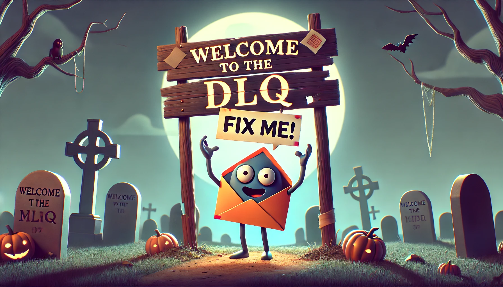

# Dead Letter Queue (DLQ)

## Introduction




In any robust messaging system, failures are inevitable. Messages might be malformed, consumers might crash, or processing logic might fail due to unforeseen data anomalies. To handle such scenarios gracefully, the Dead Letter Queue (DLQ) pattern is employed.

The primary challenge addressed by the DLQ pattern is the handling of messages that cannot be processed successfully. Without a mechanism to manage these problematic messages, they can clog the main queue, leading to processing delays and potential system outages. The DLQ pattern ensures that:

- **Unprocessable messages are isolated**: Faulty messages are moved to a separate queue to prevent them from hindering the processing of valid messages.
- **System resilience is enhanced**: By offloading problematic messages, the system can continue operating smoothly without manual intervention.
- **Error analysis is facilitated**: Storing failed messages allows developers to inspect and understand the root causes of failures.

## Key Concepts

- **Dead Letter Queue (DLQ)**: A dedicated queue that stores messages which failed to process after a predefined number of attempts.
- **Poison Messages**: Messages that consistently cause processing failures due to issues like invalid format or unexpected content.
- **Retry Mechanism**: The strategy of reattempting message processing before relegating it to the DLQ.
- **Message Acknowledgment**: A confirmation sent by the consumer to the broker indicating successful message processing.
- **Back-off Strategies**: Techniques to progressively delay retry attempts, often used to prevent overwhelming a failing service.

## Where it can be used ?

The DLQ pattern is applicable in any asynchronous messaging system where message processing reliability is crucial. Common use cases include:

- **Microservices architectures**: Ensuring that one service's failure doesn't cascade to others.
- **Event-driven systems**: Handling events that cannot be processed immediately due to temporary issues.
- **Integration platforms**: Managing message flows between disparate systems where data inconsistencies might occur.

## Example

Let's consider an e-commerce order processing system that uses a message queue to handle incoming orders. Here's an example of how a Dead Letter Queue might be implemented:

1. **Order Processing**:

    - An order message is received and processed by the `OrderProcessor` service.
    - The `OrderProcessor` service validates the order and calculates shipping costs.
    - If the order is valid, it is sent to the `ShippingService` for further processing.
    - If the order is invalid, it is sent to the DLQ.

2. **Shipping Service**:

    - The `ShippingService` service receives the order message and attempts to process it.
    - If the order is valid, it is sent to the `ShippingService` for further processing.
    - If the order is invalid, it is sent to the DLQ.

3. **DLQ**:

    - The DLQ service receives the order message and stores it.
    - The DLQ service also tracks the number of attempts to process the message.
    - If the message has been retried multiple times, it is sent to an external system for manual inspection.

4. **Monitoring and Analysis**:

    - The DLQ service provides an interface for monitoring and analyzing failed messages.
    - Developers can use this interface to understand the root causes of failures and improve the system's reliability.

This example illustrates how a DLQ can be used to isolate and manage messages that cannot be processed successfully. By implementing this pattern, the e-commerce order processing system can ensure that faulty messages do not affect the processing of valid orders and can be analyzed and resolved to prevent future failures.


## AsyncAPI Specification

Here's an AsyncAPI specification that demonstrates the Dead Letter Queue pattern:

```yaml
asyncapi: 3.0.0
info:
  title: Order Processing Service
  version: 1.0.0
channels:
  order/created:
    address: order/created
    messages:
      subscribe.message:
        $ref: '#/components/messages/OrderCreated'
  order/dlq:
    address: order/dlq
    messages:
      publish.message:
        $ref: '#/components/messages/OrderFailed'
operations:
  order/created.subscribe:
    action: send
    channel:
      $ref: '#/channels/order~1created'
    messages:
      - $ref: '#/channels/order~1created/messages/subscribe.message'
  order/dlq.publish:
    action: receive
    channel:
      $ref: '#/channels/order~1dlq'
    messages:
      - $ref: '#/channels/order~1dlq/messages/publish.message'
components:
  messages:
    OrderCreated:
      payload:
        type: object
        properties:
          orderId:
            type: string
          items:
            type: array
            items:
              type: string
    OrderFailed:
      payload:
        type: object
        properties:
          originalMessage:
            type: object
          errorDetails:
            type: string
```

## Common pitfalls

- **Infinite Retry Loops**: Without a cap on retry attempts, messages can cause endless processing cycles.
- **DLQ Overload**: Neglecting DLQ monitoring can lead to storage issues if the queue grows uncontrollably.
- **No Reprocessing Strategy**: Failing to plan for DLQ message handling can negate the benefits of capturing failed messages.
- **Security Risks**: Storing sensitive data in DLQs without proper encryption or access controls can lead to compliance violations.


## Relations with Other Patterns

- **[Retry Pattern](https://learn.microsoft.com/en-us/azure/architecture/patterns/retry)**: Works hand-in-hand with DLQ, allowing systems to attempt processing before giving up.
- **[Circuit Breaker Pattern](https://learn.microsoft.com/en-us/azure/architecture/patterns/circuit-breaker)**: Prevents a system from repeatedly trying to process messages when a service is known to be down.
- **[Fallback Pattern](https://www.codecentric.de/wissens-hub/blog/resilience-design-patterns-retry-fallback-timeout-circuit-breaker)**: Provides alternative processing logic when the primary method fails.
- **[Message Filtering Pattern](https://www.enterpriseintegrationpatterns.com/patterns/messaging/Filter.html)**: Filters out unprocessable messages early to reduce load on the system.


## References

- [Dead Letter Queue](https://en.wikipedia.org/wiki/Dead-letter_queue)
- [Implementing the Dead Letter Queue Pattern in a Microservices Architecture](https://www.ibm.com/docs/en/power8?topic=systems-implementing-dead-letter-queue-pattern-microservices-architecture)
- [DeadLetterChannel](https://www.enterpriseintegrationpatterns.com/patterns/messaging/DeadLetterChannel.html)


## Conclusion

The Dead Letter Queue pattern is a critical component in building resilient messaging systems.By understanding and applying the DLQ pattern, developers can create systems that not only handle failures gracefully but also provide avenues for diagnosing and rectifying underlying issues, ultimately leading to more stable and reliable applications.