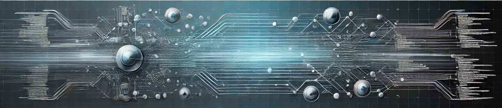

# Welcome to EDA Design Patterns website

It includes a range of patterns used in EDA with a specific focus on how to design it with [AsyncAPI](https://www.asyncapi.com/).

## Roadmap

- [X] [Add ECST pattern](./event-carried-state-transfer.md)
- [X] [Add CQRS pattern](./command-query-responsibility-segregation.md)
- [X] Basic doc rendering
- [X] Github pages
- [ ] Event Sourcing
- [ ] Change Data Capture (CDC)

Communication Patterns
- [ ] Request-Reply
- [ ] point-to-point
- [ ] event streaming
- [ ] Publish-Subscribe pattern

Consumer Scalability / Patterns
- [ ] consumer groups
- [ ] partitioning
- [ ] Exclusive Consumer (HA)

Error Handling Patterns
- [ ] dead letter queue
- [ ] discard
- [ ] pause and retry
- [ ] saga
