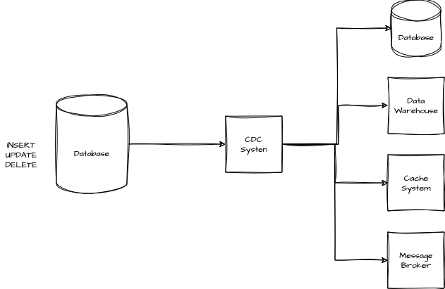

# Change Data Capture (CDC) Pattern

## What Problem Does CDC Solve?

In modern systems, data often lives in different places. Keeping all this data up-to-date and consistent can be a big challenge, especially when you need changes to happen in real-time. Traditional methods, like running batch jobs to sync everything, are slow and can lead to problems if data changes frequently.

This is where **Change Data Capture (CDC)** comes in. CDC tracks changes in a database as they happen and sends those changes to other systems. This means everyone always has the latest information, without having to wait for a batch job to run.




## Key Concepts of CDC

### CDC Producer (Source)

This is the part of the system that keeps an eye on the database for any changes. When something changes—like a new record being added, updated, or deleted—the CDC Producer captures that change and turns it into an event.

- **What It Does**: Watches the database and creates events for any changes.
- **Examples**: AWS Database Migration Service (DMS), Apache Debezium.

### CDC Consumers (Sinks)

These are the systems that listen for the CDC events. When they get an event, they do something with it—like update their own database, trigger a workflow, or process the data in some way.

- **What They Do**: React to the events by updating data, starting processes, etc. They can also move events from producer to other consumers.
- **Examples**: Data warehouses like Redshift, microservices that need consistent data, real-time analytics systems, message brokers (Kafka, Amazon SNS/SQS, RabbitMQ...)

## Where CDC is Used

In event-driven systems, you want things to happen automatically in response to data changes. CDC makes this easy by turning database changes into events that can trigger actions elsewhere. For example, when inventory levels change, CDC can trigger a reorder or notify other systems to take action.

CDC also helps with keeping your data consistent across your microservices. In a setup where different services handle different parts of your data, keeping everything consistent can be tricky. CDC helps by making sure that when one service updates its data, all other related services get that update immediately. For example, if a customer updates their profile, CDC ensures that the order service and any other relevant services are instantly aware of that change.

## Example

Let’s say you’re tracking inventory updates. Here’s a simplified way to describe how CDC would work using AsyncAPI:


```yaml
asyncapi: '3.0.0'
info:
  title: Inventory Management CDC API
  version: '1.0.0'
  description: 'API for handling CDC events related to inventory updates.'

servers:
  production:
    host: broker.example.com:9092
    protocol: kafka
    description: 'Kafka broker for production'

channels:
  InventoryCdcUpdates:
    address: inventory.cdc.updates
    messages:
      InventoryUpdateEvent:
        $ref: '#/components/messages/InventoryUpdateEvent'
    description: 'Channel for inventory update events'

operations:
  receiveInventoryUpdates:
    action: receive
    channel:
      $ref: '#/channels/InventoryCdcUpdates'
    messages:
      - $ref: '#/channels/InventoryCdcUpdates/messages/InventoryUpdateEvent'

components:
  messages:
    InventoryUpdateEvent:
      name: InventoryUpdateEvent
      title: 'Inventory Update Event'
      summary: 'Represents an inventory update in the system'
      contentType: application/json
      payload:
        type: object
        properties:
          eventType:
            type: string
            enum:
              - INSERT
              - UPDATE
              - DELETE
          entity:
            type: string
            example: 'Inventory'
          state:
            type: object
            description: 'The state of the inventory item after the change'
            properties:
              productId:
                type: string
                description: 'Unique identifier for the product'
              stockLevel:
                type: integer
                description: 'Current stock level after the update'
              lastModified:
                type: string
                format: date-time
                description: 'Timestamp when the inventory was last modified'
```


<a href="https://studio.asyncapi.com/?base64=YXN5bmNhcGk6IDMuMC4wCmluZm86CiAgdGl0bGU6IEFjY291bnQgU2VydmljZQogIHZlcnNpb246IDEuMC4wCiAgZGVzY3JpcHRpb246IFRoaXMgc2VydmljZSBpcyBpbiBjaGFyZ2Ugb2YgcHJvY2Vzc2luZyB1c2VyIHNpZ251cHMKY2hhbm5lbHM6CiAgdXNlclNpZ25lZHVwOgogICAgYWRkcmVzczogdXNlci9zaWduZWR1cAogICAgbWVzc2FnZXM6CiAgICAgIFVzZXJTaWduZWRVcDoKICAgICAgICAkcmVmOiAnIy9jb21wb25lbnRzL21lc3NhZ2VzL1VzZXJTaWduZWRVcCcKb3BlcmF0aW9uczoKICBzZW5kVXNlclNpZ25lZHVwOgogICAgYWN0aW9uOiBzZW5kCiAgICBjaGFubmVsOgogICAgICAkcmVmOiAnIy9jaGFubmVscy91c2VyU2lnbmVkdXAnCiAgICBtZXNzYWdlczoKICAgICAgLSAkcmVmOiAnIy9jaGFubmVscy91c2VyU2lnbmVkdXAvbWVzc2FnZXMvVXNlclNpZ25lZFVwJwpjb21wb25lbnRzOgogIG1lc3NhZ2VzOgogICAgVXNlclNpZ25lZFVwOgogICAgICBwYXlsb2FkOgogICAgICAgIHR5cGU6IG9iamVjdAogICAgICAgIHByb3BlcnRpZXM6CiAgICAgICAgICBkaXNwbGF5TmFtZToKICAgICAgICAgICAgdHlwZTogc3RyaW5nCiAgICAgICAgICAgIGRlc2NyaXB0aW9uOiBOYW1lIG9mIHRoZSB1c2VyCiAgICAgICAgICBlbWFpbDoKICAgICAgICAgICAgdHlwZTogc3RyaW5nCiAgICAgICAgICAgIGZvcm1hdDogZW1haWwKICAgICAgICAgICAgZGVzY3JpcHRpb246IEVtYWlsIG9mIHRoZSB1c2Vy" target="_blank">
  <br>
  Open in AsyncAPI studio
</a>


## Common Pitfalls

### Coupling to Database Schema

One common mistake is tying CDC events too closely to your database’s structure. If your database changes—like renaming a column—it could break everything that relies on those events. To avoid this, it’s better to use a logical data model that isn’t directly dependent on the database schema or use a translator.

## Relations with Other Patterns

- This can be used in combination with [ECST pattern](../Messaging/event-carried-state-transfer.md), this enable consumers to update their state or react appropriately without needing to fetch additional data
- If you are dealing with data consistency issues in a microservice architecture, you can use CDC in combination with the [transactional outbox pattern](https://newsletter.systemdesigncodex.com/i/141980437/transactional-outbox-pattern-with-cdc)
- If you are migrating from a monolith application to a microservice you can use the [CDC-Based Strangler Fig Pattern](https://newsletter.systemdesigncodex.com/i/141980437/cdc-based-strangler-fig-pattern) 


## Tools

- Debezium - Open-source, Kafka-based CDC tool.
- AWS Database Migration Service (DMS) - Managed CDC and database migration service.
- Oracle GoldenGate - Enterprise-level CDC and data integration tool for Oracle databases.
- IBM InfoSphere Data Replication (IIDR) - CDC tool for various databases, with a focus on low-latency replication.
- Striim - Real-time data integration platform with CDC capabilities.

## Conclusion

The Change Data Capture pattern is a powerful way to keep your data synchronized across systems in real-time. Whether you’re looking to ensure data consistency in a microservices architecture or trigger events in response to data changes, CDC can make your system more responsive and reliable. Just be mindful of potential pitfalls like tightly coupling your events to the database schema, and you’ll be well on your way to a more resilient system.
