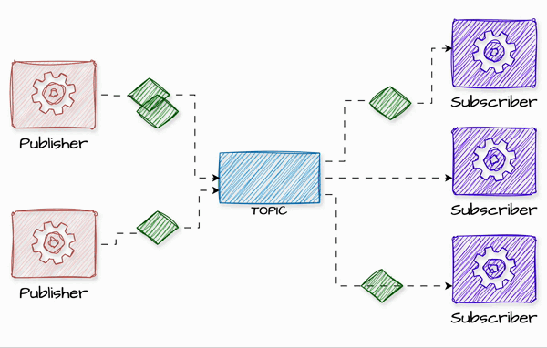

# Publish-Subscribe (Pub/Sub)

## Introduction


The Publish-Subscribe (Pub/Sub) event-driven pattern is a powerful way to handle asynchronous communication between different services, allowing for decoupling and scalability. This pattern is widely used in distributed systems to facilitate effective message passing and achieve a modular architecture. In this section, we'll introduce the concept of the Pub/Sub pattern, define key terms, and explore its typical use-cases.

**What is the Publish-Subscribe (Pub/Sub) Pattern?**

The Pub/Sub pattern is an event-driven messaging paradigm where publishers send messages (events) without knowledge of who will receive them, and subscribers receive messages without knowing who sent them. This decouples the producers and consumers of messages, allowing services to operate independently. The core components of this pattern are:

- **Publisher**: The component that creates and sends events.
- **Subscriber**: The component that listens for and processes events.
- **Message Broker**: The intermediary that receives events from publishers and forwards them to all interested subscribers. Examples include Kafka, RabbitMQ, and AWS SNS.

In Pub/Sub, services communicate by publishing and subscribing to topics or channels, which act as communication points for sending and receiving messages. This decoupled approach enables better scalability, maintainability, and flexibility for complex applications.


**How Pub/Sub Messaging Works**

Pub/Sub messaging works through a series of components that interact to facilitate message delivery between producers and consumers. Here is an overview of the key elements involved:

1. **Publisher**: A publisher is an entity or service that creates and sends messages about specific events. The publisher does not need to know who will receive the messages. It simply sends the message to a **topic**.

2. **Topics**: A topic acts as an intermediary channel where messages are published. It serves as a conduit between publishers and subscribers. The publisher sends messages to a topic, and subscribers register their interest in that topic to receive the messages.

3. **Subscriber**: A subscriber is an entity that registers to one or more topics to receive messages. Subscribers can take actions based on the received messages, such as updating a database, sending notifications, or processing data. Each subscriber independently processes the message without the publisher's involvement.

4. **Message Broker**: A message broker manages the topics and handles the distribution of messages from the publisher to all registered subscribers. It ensures that messages are delivered to the right subscribers and can provide additional features such as message filtering, retries, and durability.





**Key Features**

- **Push Delivery**: Pub/Sub messaging provides push-based delivery, where messages are instantly delivered to subscribers when they are published. This eliminates the need for subscribers to constantly check (poll) for new messages.
- **Fanout**: In a fanout scenario, a single message sent to a topic is replicated and delivered to multiple subscribers. This allows for parallel processing of messages, making it ideal for use cases that require multiple independent actions to be taken on a single event.
- **Filtering**: Some systems support message filtering, allowing subscribers to specify which messages they want to receive from a topic, reducing unnecessary processing.
- **Decoupling**: Publishers and subscribers are completely decoupled, meaning they do not need to be aware of each other's existence. This leads to a more flexible and scalable system where new services can be added or removed without affecting existing functionality.

**Typical Use-Cases of Pub/Sub**

The Pub/Sub pattern is highly versatile and can be applied to numerous use-cases in modern software systems, including:

- **E-commerce Order Processing**: When a customer places an order, various services need to take action, such as inventory updates, customer notifications, and analytics. Instead of tightly coupling all these services, an "Order Placed" event can be published, and each interested service can independently subscribe and respond.
- **Real-Time Notifications**: Applications that need to send notifications to users, such as messaging platforms or social networks, can use Pub/Sub to distribute events in real time to multiple services that generate push notifications or emails.
- **Data Synchronization**: In distributed systems where data consistency is essential, Pub/Sub can be used to keep data synchronized across multiple services by broadcasting updates as events.
- **IoT Systems**: Devices in IoT networks often need to communicate state changes or sensor data. A Pub/Sub model allows these devices to publish data to a broker, which can then distribute it to any number of subscribers, such as data processing systems or monitoring dashboards.

**Example: The Pub/Sub Pattern in a E-commerce application**

Imagine that the e-commerce application has several services, such as Inventory Management, Order Processing, Customer Notifications, and Analytics. When a customer places an order, many different actions need to happen:

- The Inventory Management service should update the product quantity.
- The Customer Notifications service should send an email or SMS to the customer.
- The Analytics service should record the transaction for future insights.

Instead of having the Order Processing service call each of these services directly, the Publish-Subscribe pattern allows Order Processing to simply publish an "Order Placed" event. This event is then received by any interested service, allowing them to take action independently.

**AsyncAPI Example**

AsyncAPI is a specification for documenting and defining event-driven APIs, much like how OpenAPI works for REST APIs. Let's define the `order.placed` event for the e-commerce application using AsyncAPI.

```yaml
asyncapi: 3.0.0
info:
  title: E-commerce Event API
  version: 1.0.0
  description: AsyncAPI definition for events in the e-commerce platform.
channels:
  orders:
    address: /v1/orders
    messages:
      orderData:
        contentType: application/json
        payload:
          type: object
          properties:
            orderId:
              type: string
              description: Unique identifier for the order.
            customerId:
              type: string
              description: Unique identifier for the customer.
            items:
              type: array
              items:
                type: object
                properties:
                  productId:
                    type: string
                    description: Unique identifier for the product.
                  quantity:
                    type: integer
                    description: Quantity of the product ordered.
            totalAmount:
              type: number
              description: Total amount of the order.
    description: Channel for order placed events.
operations:
  sendOrders:
    action: send
    channel:
      $ref: '#/channels/orders'
    summary: Send order data to the broker.
    messages:
      - $ref: '#/channels/orders/messages/orderData'
  recieveOrders:
    action: receive
    channel:
      $ref: '#/channels/orders'
    summary: Recieve order data from the broker.
    messages:
      - $ref: '#/channels/orders/messages/orderData'

```

[Open In AsyncAPi Studio](https://studio.asyncapi.com/?share=62f01f93-cd38-4a0e-b414-505264fe43c6)

In this AsyncAPI definition, the `order/placed` channel is defined as the communication point for publishing order events. The payload of the event contains details such as `orderId`, `customerId`, the list of `items` ordered, and the `totalAmount`. This document provides a clear contract for services that subscribe to the `order.placed` event, ensuring consistency across the system.

**Benefits of Using Pub/Sub**

- **Scalability**: New services can be added easily by simply subscribing to existing events.
- **Decoupling**: Publishers and subscribers do not need to know about each other's implementations.
- **Reliability**: With message brokers, messages can be stored and retried, ensuring no events are lost if a service is temporarily down.
- **Push-Based Delivery**: Eliminates the need for polling by subscribers, enabling faster response times and reducing latency.
- **Dynamic Targeting**: Subscribers can be added or removed dynamically without impacting the publisher, making the system more flexible.
- **Simplified Communication**: Reduces the complexity of point-to-point integrations, resulting in cleaner and more maintainable code.

The Publish-Subscribe pattern, with the help of AsyncAPI, enables the e-commerce application to build a scalable, flexible, and maintainable architecture for handling complex workflows, all while keeping services independent and easy to manage.

**Relation with Other Event-Driven Architecture (EDA) Patterns**

The Pub/Sub pattern is often used in conjunction with other event-driven architecture patterns to build robust and scalable systems. Some relevant patterns include:

- **Event-Carried State Transfer (ECST)**
- **Command Query Responsibility Segregation (CQRS)**
- **Event Sourcing**
- **Change Data Capture (CDC)**
- **Dead Letter Queue (DLQ)**